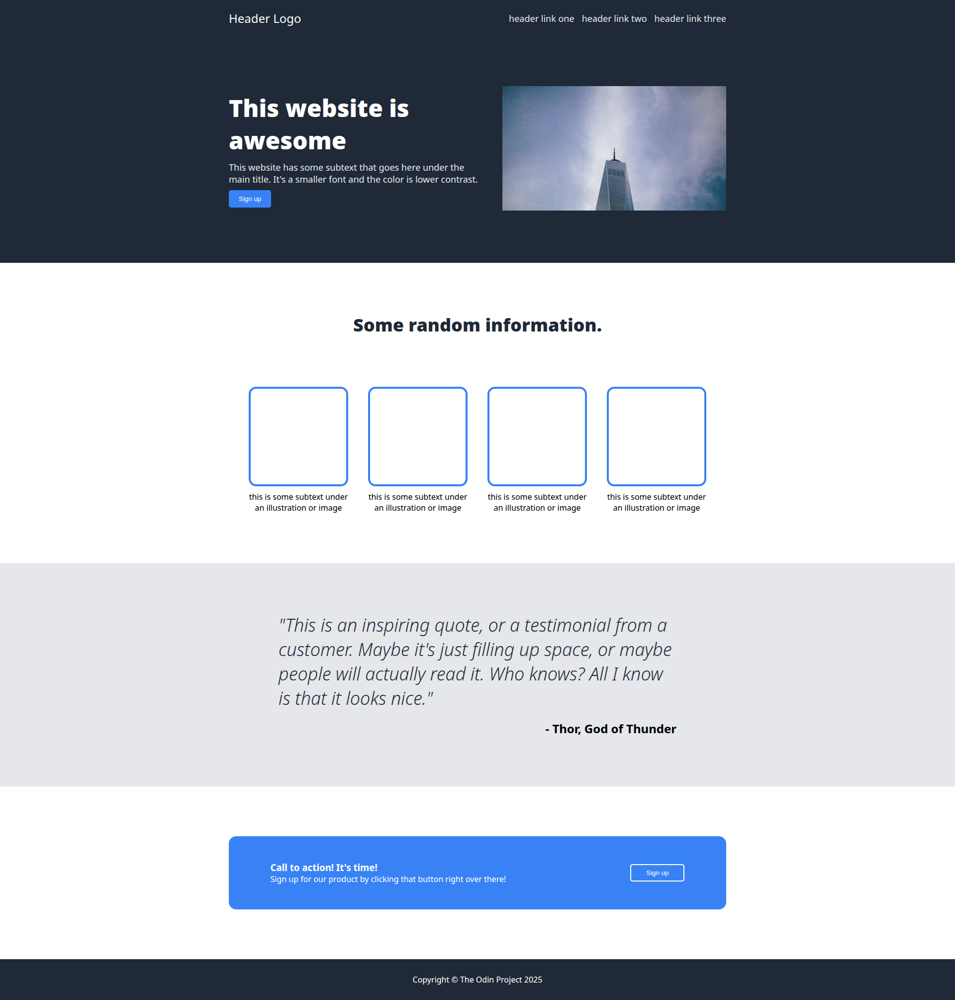

# Landing Page - The Odin Project

This is a solution to the [Landing Page assignment](https://www.theodinproject.com/lessons/foundations-landing-page) from The Odin Project.

**[View Live Demo](https://hasanhozgur.github.io/odin_landing_page/)**

## The Challenge
The goal was to recreate a specific landing page design using valid HTML and CSS, with a strong focus on using Flexbox for the layout.

## Screenshot

## Project Notes
> **Constraint:** This project is not responsive. It is designed to look good on a standard desktop screen (1920x1080 or similar), strictly following the assignment requirements.

## Technologies Used
* HTML
* CSS (Flexbox)
